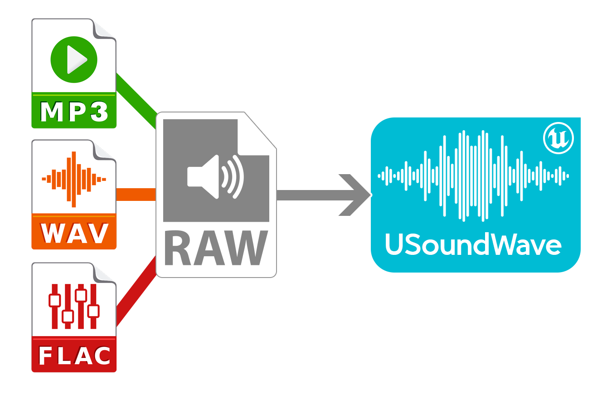
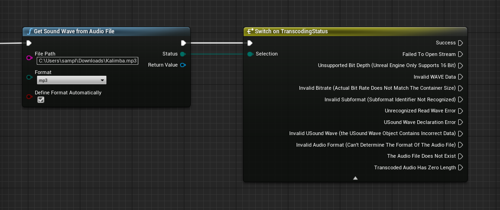

# RuntimeAudioImporter
This plugin will be useful for those who want to be able to import audio files of MP3, WAV and FLAC formats into the game in runtime (for example, if the game involves importing audio files from the player's device memory). It's easy to use in both C++ and Blueprints.
Some theoretical information is presented here: [How to import an audio file into Unreal Engine at runtime](https://unreal.blog/how-to-import-an-audio-file-into-unreal-engine-at-runtime).

## Features
- Low library size (≈ 1 mb)
- Fast transcoding speed (≈ 200-900 ms)
- Supported for major audio formats: MP3, WAV and FLAC
- Automatic detection of audio format (by extension)
- System for obtaining transcoding status for error detection
- No any external dependencies
- Support for all available devices (tested on Windows and Android, but there are no restrictions to work on other devices)

## How to install
There're two ways to install the plugin:
1) [Through the marketplace](https://www.unrealengine.com/marketplace/product/runtime-audio-importer)
2) Manual installation. Just extract the "RuntimeAudioImporter" folder into your plugins project folder to get the following path: "[ProjectName]/Plugins/RuntimeAudioImporter".

## How to use
 There are two ways to use this plugin: using Blueprints and C++:
 1. Blueprints. Just reopen your Unreal project and find a node "GetSoundWaveFromAudioFile".
 2. C++. Open your "[ProjectName].Build.cs" and find a block of ` PublicDependencyModuleNames ` or ` PrivateDependencyModuleNames ` (it depends on your needs). Add `"RuntimeAudioImporter"` String inside this block. After just include "RuntimeAudioImporterBPLibrary.h" using ` #include "RuntimeAudioImporterBPLibrary.h" ` where needed.

## Additional information
The in-memory audio transcoding operation is based on [dr_libs](https://github.com/mackron/dr_libs).

## Legal info

Unreal® is a trademark or registered trademark of Epic Games, Inc. in the United States of America and elsewhere.

Unreal® Engine, Copyright 1998 – 2020, Epic Games, Inc. All rights reserved.
